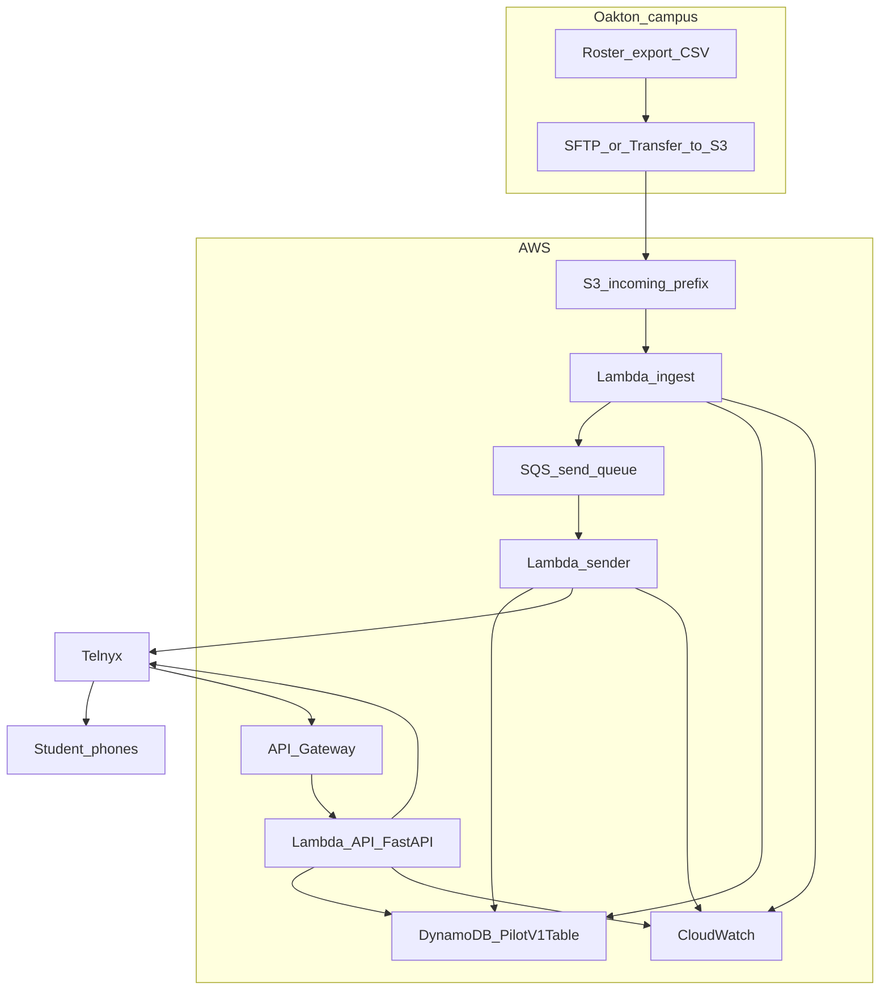

# Oakton Alert pilot v1 — architecture (first draft)

This document matches the **pilot-v1** application in the repo and the **SAM stack** in [`deploy/template-pilot.yaml`](../deploy/template-pilot.yaml). The original [`pilot-oakton-alert/`](../pilot-oakton-alert/) tree is kept as a **frozen baseline**; active development lives under [`pilot-v1/`](../pilot-v1/).

## Purpose

- **Inbound SMS**: Telnyx `message.received` → `POST /api/sms/webhook` → canned intents + STOP/START/HELP ([`pilot-v1/webhook.py`](../pilot-v1/webhook.py)).
- **Manual / API triggers**: `POST /api/trigger` and ops endpoints ([`pilot-v1/trigger.py`](../pilot-v1/trigger.py), [`pilot-v1/ops_api.py`](../pilot-v1/ops_api.py)).
- **Roster-driven sends**: CSV uploaded to **S3** under `incoming/` → **ingest Lambda** validates rows → **SQS** → **sender Lambda** → Telnyx.
- **Durable opt-out and campaign gates**: **DynamoDB** table `PilotV1Table` (partition `pk` + sort `sk`) for opt-outs, campaign metadata, batch metadata, and per-batch send deduplication keys.

## As deployed today vs previous pilot

| Aspect | Frozen [`pilot-oakton-alert/`](../pilot-oakton-alert/) | **pilot-v1** + [`template-pilot.yaml`](../deploy/template-pilot.yaml) |
|--------|--------------------------------------------------------|------------------------------------------------------------------------|
| Opt-out | In-memory only | **DynamoDB** when `PILOT_DYNAMODB_TABLE` is set (Lambda); in-memory locally if unset |
| Roster file → SMS | Manual API only | **S3** `incoming/*` → **ingest** → **SQS** → **sender** |
| Campaign deadline | N/A | `CAMPAIGN_DEADLINE_ISO` + `CAMPAIGN_ACTIVE` (stack parameters / env) |
| Lambda functions | 1 (API) | **3**: API (`main.handler`), ingest (`ingest_handler.handler`), sender (`sender_handler.handler`) |

## End-to-end diagram

See also: Mermaid source [`docs/diagrams/pilot-architecture.mmd`](diagrams/pilot-architecture.mmd), exported slide image [`docs/diagrams/pilot-architecture.png`](diagrams/pilot-architecture.png), and export commands in [`docs/diagrams/README.md`](diagrams/README.md).



In production, **SFTP** is often **AWS Transfer Family** writing to the same bucket prefix; behavior matches **uploading** an object to `s3://.../incoming/`.

## Day in operation (summary)

1. **Morning**: Authorized process drops `roster.csv` into `incoming/` (or Transfer completes).
2. **Ingest**: Lambda parses CSV (`phone` column or first column), skips invalid rows and opted-out numbers, enqueues one SQS message per intended send, writes **batch** metadata to DynamoDB.
3. **Sender**: For each message, re-checks opt-out, **dedupes** `(batch_id, phone)` in DynamoDB, sends SMS via Telnyx.
4. **Inbound**: Student texts STOP → API persists opt-out in DynamoDB → future sends skip that number.
5. **Deadline**: If `CAMPAIGN_ACTIVE=false` or current time is past `CAMPAIGN_DEADLINE_ISO`, **ingest** refuses to queue new sends (sender still honors queue for messages already queued—operational nuance: set deadline before large uploads).

## Security and PII

- **IAM**: SAM grants each function **least privilege** (DynamoDB table, SQS send/receive). Ingest reads roster objects via **`PilotInboundBucketPolicy`**: only `s3:GetObject` on `incoming/*` for the ingest role (avoids IAM→bucket circular deps with S3-triggered Lambda).
- **Secrets**: Telnyx keys are stack parameters (consider **Secrets Manager** for hardening).
- **Logs**: Ingest/sender log **counts** and **errors**, not full phone numbers in production (tighten further as needed).
- **Developer hygiene**: Do not commit real rosters; use **synthetic numbers** in tests ([`docs/PILOT_E2E_SFTP.md`](PILOT_E2E_SFTP.md)).

## Reliability hardening (implemented)

- **Double-fence policy checks**: campaign deadline/active checks at both ingest and sender.
- **DLQ for sender queue**: failed messages are moved after retry attempts (SQS redrive max receive count = 3).
- **Ingest monitoring**: CloudWatch alarms on ingest Lambda **Errors** and **Throttles** (optional **SNS** target via stack parameter `AlarmNotificationTopicArn`; same parameter wires **DLQ** alarm notifications).
- **Timeout/visibility guardrail**: sender timeout is 45s and queue visibility timeout is 180s to reduce duplicate in-flight processing.
- **DynamoDB TTL lifecycle**: `expires_at` is enabled on the table and used for transient records (batch metadata + dedup markers).
- **Ingest resilience**: per-row enqueue `try/except` prevents one SQS error from failing the whole CSV run.

## Open decisions (for Oakton)

- AWS account ownership and Telnyx **DPA/BAA** if required.
- Preferred secure transfer (**Transfer Family**, vendor MFT, etc.).
- Retention policy for S3 objects and TTL horizon for DynamoDB transient rows.
- Alarm routing destination (SNS / PagerDuty / email) for the DLQ CloudWatch alarm.

## Deploy

From repo root (requires `.env` with Telnyx and AWS credentials):

```bash
./deploy/deploy-pilot.sh
```

Optional in `.env`: `ALARM_NOTIFICATION_TOPIC_ARN` — SNS topic ARN; wires **ingest** (errors/throttles) and **DLQ** CloudWatch alarms to email/Slack/etc.

Stack outputs include **WebhookUrl**, **PilotInboundBucketName**, **PilotV1TableName**, **PilotSendQueueUrl**, **PilotSendDlqUrl**.

Optional parameter overrides (see template): `CampaignDeadlineIso`, `CampaignActive`, `DefaultCampaignId`, `DefaultTriggerType`, `DefaultReminderDays`.

## Local development

```bash
cd pilot-v1
pip install -r requirements.txt
uvicorn main:app --reload --port 8001
```

Without `PILOT_DYNAMODB_TABLE`, opt-out remains **in-memory** (same as early pilot).
